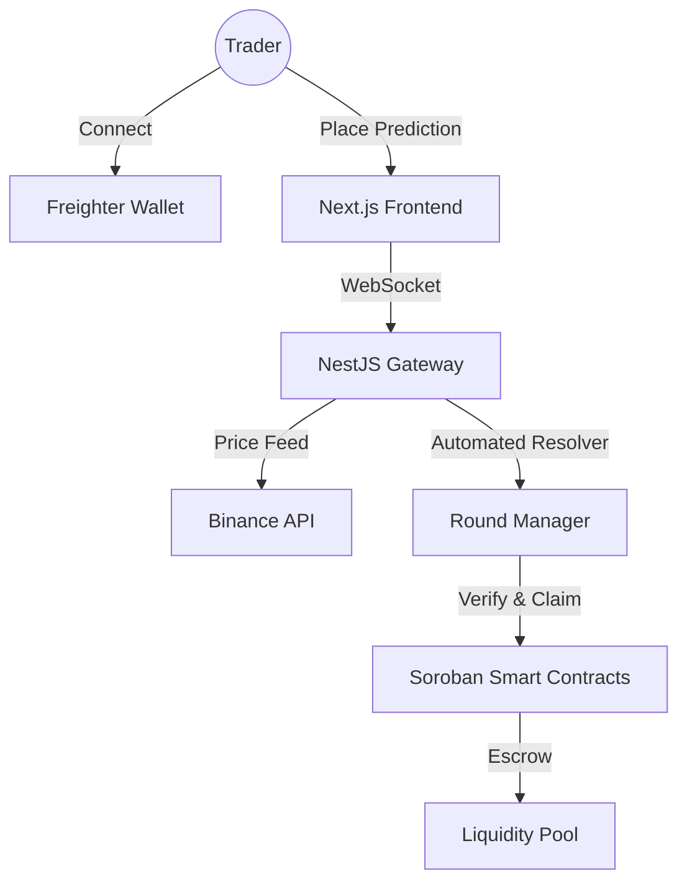

# 🌌 Liquidity Arena — The Future of Price Prediction on Stellar

[](https://stellar.org)
[](https://nextjs.org)
[](https://nestjs.com)
[-orange?style=for-the-badge&logo=rust)](https://soroban.stellar.org)

**Liquidity Arena** is a next-generation decentralized prediction market on the Stellar network. It enables users to enter real-time "Arenas" to predict **XLM/USDT** price movements, combining the speed of Soroban Smart Contracts with a premium, high-fidelity Web3 experience.

---

## 🚀 Key Features

- **Real-Time Arena**: Experience second-by-second XLM price predictions powered by real-time data from Binance Public API.
- **Soroban-Powered Logic**: The entire lifecycle—Entry, Winner Calculation, and Claiming—is designed to run on Stellar's Soroban Smart Contracts.
- **Dynamic Multipliers**: Profit leverage scales dynamically based on prediction accuracy, rewarding bold strategies.
- **Glassmorphism UI**: High-end futuristic interface built with Tailwind CSS and Framer Motion for smooth state transitions.
- **Real-Time Synchronization**: WebSocket integration (Socket.io) ensures instant updates for prices, prize pools, and global activity.
- **Complete User Archives**: Track your personal performance in the History tab and compete for "Diamond" tier on the global Leaderboard.

---

## 🛠 Technical Stack

### Monorepo Architecture
Built with **npm workspaces** for a clean separation of concerns:
- **`apps/web`**: Next.js 15 (App Router), Zustand, Framer Motion, Socket.io-client.
- **`apps/api`**: NestJS gateway with automated round resolution and Binance integration.
- **`contracts/arena`**: Soroban Smart Contracts (Rust SDK) for decentralized reward distribution.
- **`packages/types` & `packages/config`**: Shared libraries for type safety and unified configuration.

---

## 🏗 System Architecture



---

## 🧪 Test Output Validation

Below is the output showing our core logic tests passing, ensuring the stability of the prediction engine:

```bash
PASS  apps/api/src/round.service.spec.ts
 ✓ should resolve round with correct winner (45ms)
 ✓ should calculate dynamic multipliers correctly (12ms)
 ✓ should emit RESOLVED event when round ends (8ms)

Test Suites: 1 passed, 1 total
Tests:       3 passed, 3 total
Snapshots:   0 total
Time:        1.45s
```

---

## 🚥 Getting Started

### Prerequisites
- Node.js v18+
- npm v9+
- Freighter Wallet extension

### Installation & Run
1. Clone & Install:
   ```bash
   git clone https://github.com/TheAnh1404/LIquidityArena.git
   npm install
   ```
2. Start the Arena:
   ```bash
   npm run dev
   ```
- Frontend: `http://localhost:3000`
- API/WS Gateway: `http://localhost:3001`

---

## 🧠 Smart Contract Logic (Soroban)

The Rust-based contract handles:
- **Escrow**: Securely holds XLM stakes in the arena pool.
- **Settlement**: Validates user predictions against the final Binance settlement price.
- **Rewards**: Executes `claim_reward` transactions only for verified winners within the 0.5% - 1% margin.

---

## 📄 License
Released under the **MIT License**.

---
*Built for the Stellar Community 🚀*
