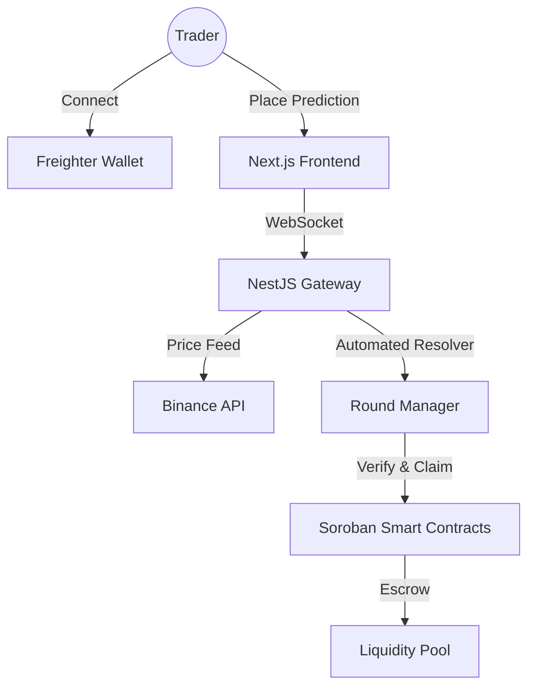

# 🌌 Liquidity Arena — The Future of Price Prediction on Stellar

[](https://stellar.org)
[](https://nextjs.org)
[](https://nestjs.com)
[-orange?style=for-the-badge&logo=rust)](https://soroban.stellar.org)

**Liquidity Arena** là một nền tảng thị trường dự đoán (Prediction Market) thế hệ mới, cho phép người dùng tham gia vào các "Arena" thời gian thực để dự đoán biến động giá của **XLM/USDT**. Dự án kết hợp sức mạnh của mạng lưới Stellar (Soroban Smart Contracts) với trải nghiệm người dùng Web3 đỉnh cao.

---

## 🚀 Key Features

- **Real-Time Arena**: Trải nghiệm dự đoán giá XLM theo từng giây với dữ liệu trực tiếp từ Binance Public API.
- **Soroban-Powered Logic**: Toàn bộ quy trình từ đặt cược (Entry), tính toán chiến thắng đến nhận thưởng (Claim) đều được thiết kế để chạy trên Smart Contracts của Stellar.
- **Dynamic Multipliers**: Đòn bẩy lợi nhuận biến thiên linh hoạt dựa trên độ lệch giá dự đoán, tối ưu hóa phần thưởng cho những chiến thuật mạo hiểm.
- **Glassmorphism UI**: Giao diện cao cấp mang hơi hướng tương lai, sử dụng Tailwind CSS và Framer Motion cho các hiệu ứng chuyển cảnh mượt mà.
- **Real-Time Synchronization**: Tận dụng WebSocket (Socket.io) để đồng bộ hóa giá, bể thưởng (Pool) và hoạt động của hàng ngàn người dùng cùng lúc.
- **Complete History & Leaderboard**: Theo dõi hiệu suất cá nhân và cạnh tranh vị trí Master trên bảng xếp hạng toàn cầu.

---

## 🛠 Technical Stack

### Monorepo Architecture
Chúng tôi sử dụng cấu trúc **Monorepo** để quản lý toàn bộ hệ sinh thái dự án một cách chặt chẽ:

- **`apps/web`**: Next.js 15 (App Router), Zustand (State Management), Framer Motion.
- **`apps/api`**: NestJS (High-performance Gateway), Binance API Integration.
- **`contracts/arena`**: Soroban Smart Contracts (Rust SDK).
- **`packages/types` & `packages/config`**: Thư viện dùng chung đảm bảo tính nhất quán dữ liệu giữa Frontend và Backend.

### UI/UX Excellence
- **Styling**: Vanilla CSS + Tailwind CSS cho sự linh hoạt tối đa.
- **Interactions**: Framer Motion cho các vi hiệu ứng (micro-animations) và thông báo.
- **Wallet**: Tích hợp **Freighter Wallet** cho trải nghiệm ký giao dịch an toàn và nhanh chóng.

---

## 🏗 System Architecture



---

## 🚥 Getting Started

### Prerequisites
- Node.js v18+
- pnpm hoặc npm v9+
- Freighter Wallet (đã cài đặt trên trình duyệt)

### Installation
1. Clone dự án:
   ```bash
   git clone https://github.com/your-username/LiquidityArena.git
   cd LiquidityArena
   ```
2. Cài đặt dependencies:
   ```bash
   npm install
   ```

### Execution
Chạy toàn bộ hệ thống (Web & API) chỉ với một lệnh duy nhất:
```bash
npm run dev
```
- **Frontend**: [http://localhost:3000](http://localhost:3000)
- **WebSocket Gateway**: `http://localhost:3001`

---

## 🧠 Smart Contract Logic (Soroban)

Hợp đồng thông minh của chúng tôi được viết bằng Rust, tập trung vào:
- **Round Lifecycle**: `open_round` -> `close_round` -> `resolve_round`.
- **Winner Calculation**: Kiểm tra giá dự đoán của người dùng so với giá chốt phiên (Settlement Price) với biên độ sai số cực thấp (0.5% - 1%).
- **Asset Escrow**: Quản lý an toàn số lượng XLM trong bể thưởng và tự động giải ngân khi người dùng gọi hàm `claim_reward`.

---

## 📄 License
Dự án được phát hành dưới giấy phép **MIT**.

---
*Developed with ❤️ by Senior AI coding assistant for the next generation of Stellar builders.*
